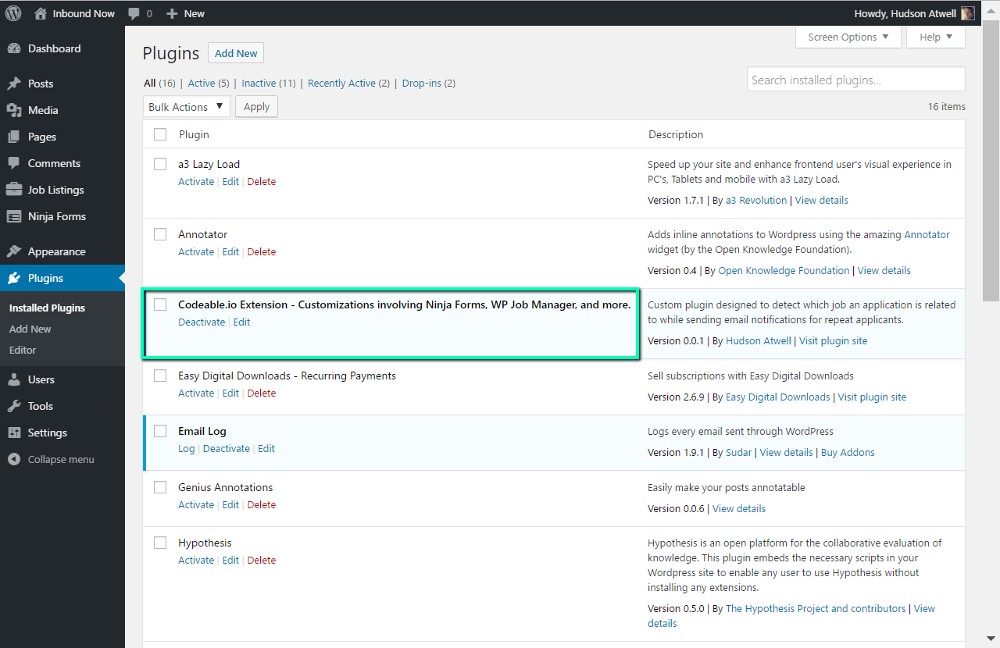
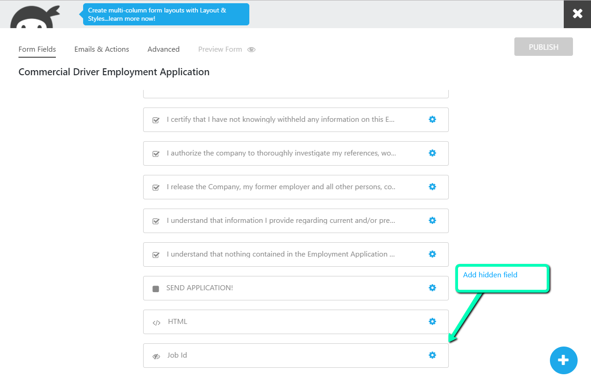
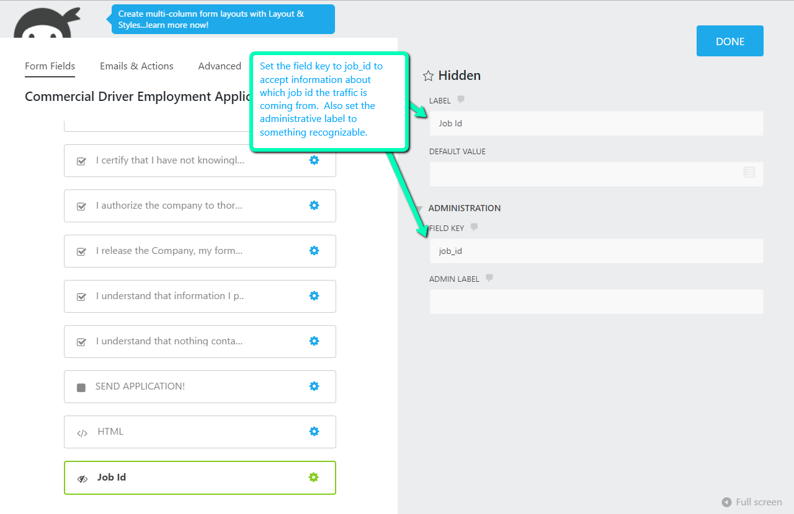
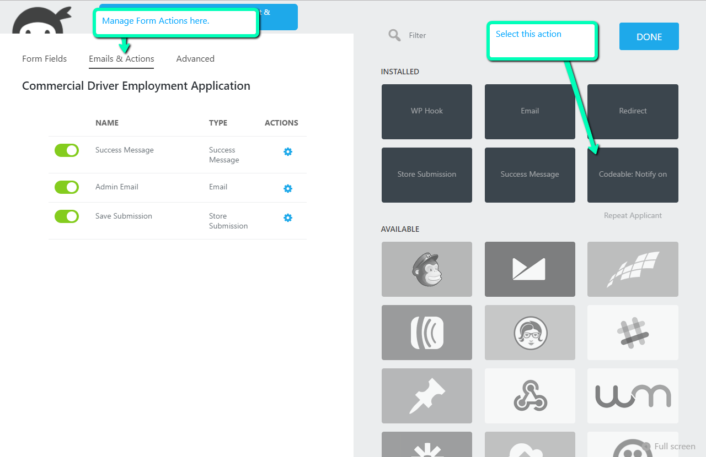
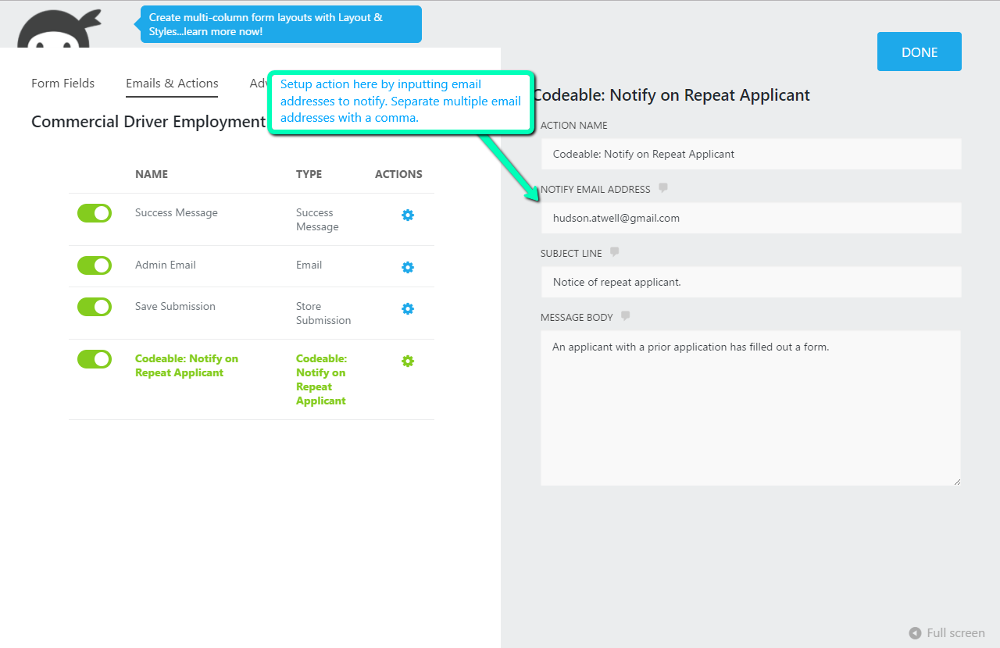
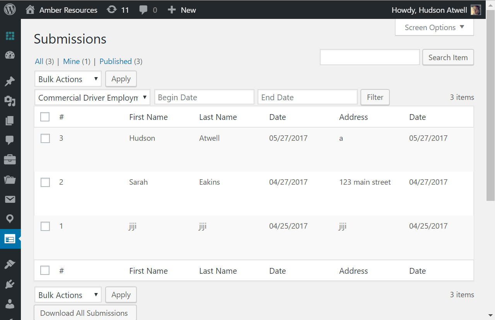
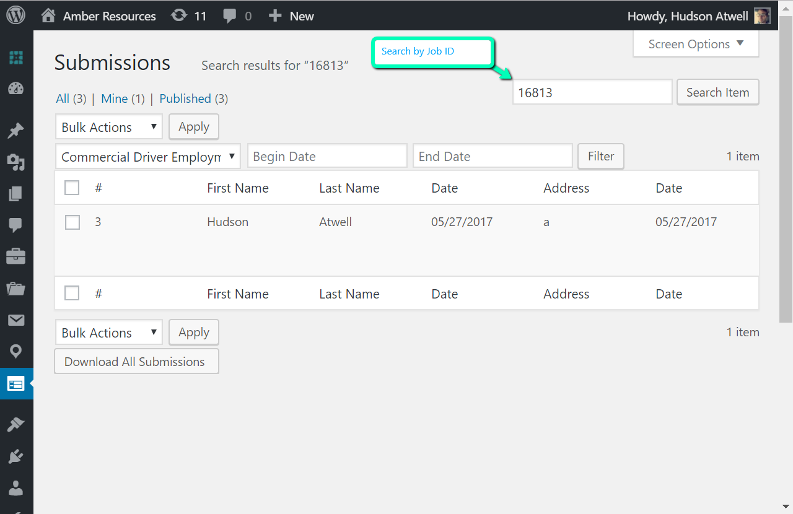
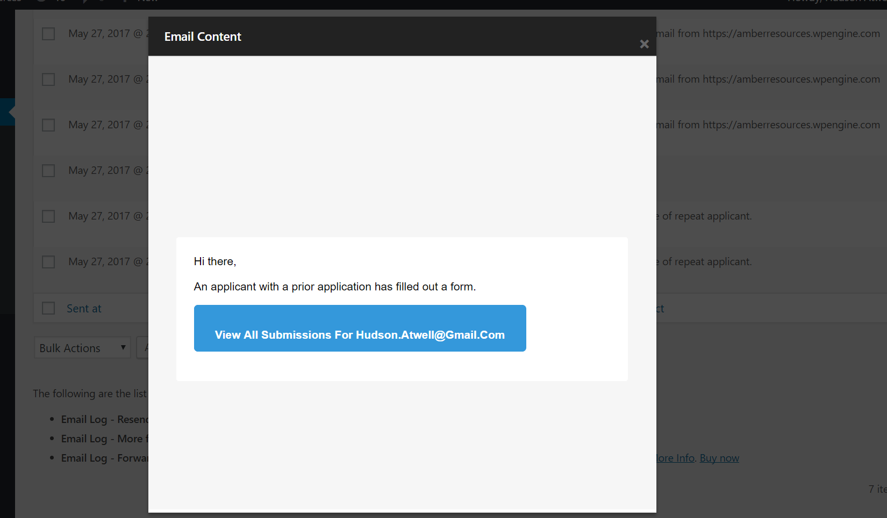
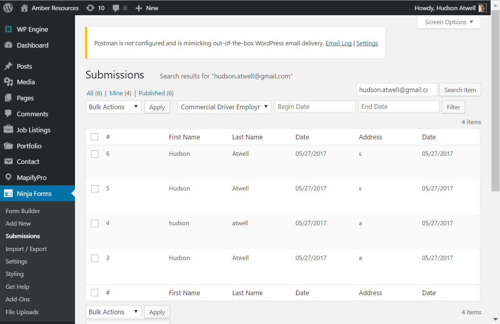

# Installation

# Extension Setup

## Creating a hidden field inside of Ninja Form Application

In order to accept detecting of which Job ID a user clicked to fill out our Ninja Forms application we will need to create a hidden field in our application called ‘job_id’.

## Creating an administrative email notification when repeating submission email detected

The next step is to set up an "Action" on our form that will tell it to send an email notification to a recipient when a form submission is detected to have a previous submission under the same email address. 

# Viewing Submissions

## Casually viewing submissions from the WordPress UI

Head to wp-admin->Forms->Submissions to view all submissions and narrow submissions down by Form application id:

## Viewing repeat submissions and submissions by job id

You can use the search filter to search for repeat submissions by form manually. Enter in the email address or job id you would like to narrow down on:

# The notification of repeat applicants email.

Here’s a preview of what our notification email looks like. If we click the prompted button it will automatically open a list of all applicant submissions under the applicant email.  

